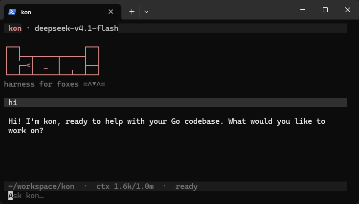

# kon

`kon` is a terminal coding agent that lives in your project directory. Point it
at a task and it reads, edits, and runs commands until the work is done.

It is built on a few beliefs:

- **Few tools, not many.** kon follows [pi](https://pi.dev/)'s four-tool
  philosophy: the model gets exactly `read`, `write`, `edit`, and `shell`.
  Sharper tools mean it spends its context on your code, not on a tool menu.
- **Instant and snappy.** One static binary that starts immediately and streams
  its answer as it arrives — no daemon, no warm-up.
- **Reliable anywhere.** Linux, macOS, and Windows, with no account and no
  plugins. Run it wherever you are.
- **No vendor lock-in.** Sessions are plain JSONL files you can read, grep, and
  keep; any OpenAI-compatible endpoint works. Your prompts never disappear
  behind a database.



## Install

One line, Linux and macOS:

```sh
curl -fsSL https://raw.githubusercontent.com/hizkifw/kon/main/scripts/install.sh | sh
```

Windows, in PowerShell:

```powershell
iwr -useb https://raw.githubusercontent.com/hizkifw/kon/main/scripts/install.ps1 | iex
```

Install with Go:

```sh
go install github.com/hizkifw/kon/cmd/kon@latest
```

## Getting started

Run `kon` from the directory where you want the agent to work. On first launch
it creates a config file and opens the editor directly at the prompt — nothing
is sent anywhere until you ask. Until a model is configured, kon greets you in
the transcript with a short welcome that names the config file and the basic
keys (`/` for commands, `Ctrl+D` to exit).

1. Open the config at `~/.config/kon/config.json` (Windows: `%APPDATA%\kon\config.json`)
   and add a model. Any OpenAI-compatible endpoint works:

   ```json
   {
     "default_model": "fast",
     "models": [
       {
         "name": "fast",
         "provider": "openai",
         "model": "gpt-5-mini",
         "api_key": "sk-...",
         "context_window_tokens": 128000
       },
       {
         "name": "local",
         "provider": "ollama",
         "model": "qwen3-coder",
         "base_url": "http://localhost:11434",
         "context_window_tokens": 32768
       }
     ]
   }
   ```

2. Restart `kon` and type a prompt.

That's the whole setup. Providers are `openai`, `openrouter`, `ollama`, and
`openai-compatible` (anything else speaking the OpenAI Chat Completions format;
set `base_url` for those, and give every profile its own `name` and `model`
ID). The config file is created with owner-only permissions since it holds a
literal API key.

Set `context_window_tokens` on every model. kon uses it to show context usage in
the header and to start compaction before the window fills. A value of `0`
(unknown) disables proactive compaction, so a long session then relies only on
the provider's own overflow error to trigger a summary — fine for a short chat,
but set the real window size for real work. The numbers above are examples.

Models that accept image input take `"vision": true` in their profile. kon's
`read` tool then loads image files (png, jpeg, gif, webp, up to 5 MB) as image
content instead of text, so you can ask about screenshots and diagrams in the
workspace. Without the flag, reading an image returns a notice the model can
act on instead of opaque bytes.

## Project instructions

kon follows the [AGENTS.md](https://agents.md) convention. On startup it walks
up from the working directory to the filesystem root and loads the first
`AGENTS.md` it finds in each directory, using them as project instructions in
the system prompt. A repository root and nested packages can each contribute
conventions; inherited files come first and the most specific ones last.

`CLAUDE.md` is accepted as a compatibility alias, and `AGENTS.override.md`
replaces the plain file in the directory that holds it. Empty files and
directories whose name begins with `.` are ignored. Set `"context_files": false`
in the config to disable discovery.

The prompt is recorded when a session is created, so edits to these files apply
to new sessions (`/new` or a fresh launch); a resumed session keeps the prompt
it started with.

## Resuming work

kon prints a resume hint when it exits:

```text
resume with: kon --resume ses_7Yk2mP9Qa4Zx8Vc1Nd6R
```

Use that command, or `kon --resume` alone to reopen the most recent session for
the directory. Inside the app, `/resume` lists sessions for the current
directory and `/resume <id>` switches to one. Typing `/resume ` opens a picker;
each row is labelled with the session's first prompt and creation time, and
highlighting a row previews the session's last couple of turns in the transcript
without switching to it. `Esc` cancels the preview and restores the live
session. Sessions are stored as JSONL files under `~/.local/share/kon/sessions/` — see
[Session format](docs/session-format.md) if you want to read or build on them.

## Commands

Type `/` at the start of the prompt to see the available commands:

| Command | Action |
| --- | --- |
| `/new` | Start a new session with the active model |
| `/model [name]` | List model profiles, or switch to one |
| `/resume [id]` | List sessions for this directory, or switch to one |
| `/compact` | Summarize older context now instead of waiting for the automatic threshold |

## Keys

| Key | Action |
| --- | --- |
| Enter | Submit the prompt, or accept the selected suggestion |
| Shift+Enter / Ctrl+Enter | Insert a newline |
| Enter after a trailing `\` | Continue on a new line instead of submitting |
| Tab / Shift+Tab | Fill in the selected suggestion |
| Up/Down | Recall prompts, or move the suggestion selection |
| Esc | Dismiss the popup, or cancel generation without killing a running command |
| Page Up/Page Down | Scroll the transcript |
| Mouse wheel | Scroll the transcript |
| Ctrl+C | Cancel active work, or exit while idle |
| Ctrl+D | Quit when the input is empty |

The status bar shows the working directory, context usage, and a status
message; the header shows the active model. `ctx ~12.4k/128k` means usage is
estimated; a `?` means the provider has not supplied enough information yet.

## What the agent can do

Tool calls run serially in the directory where kon was started:

- `read` returns numbered file contents, at most 2,000 lines and 1 MiB.
- `write` atomically creates or replaces a file.
- `edit` replaces exactly one occurrence and fails on zero or multiple matches.
- `shell` runs a command through `/bin/sh` (or the Windows shell) with a
  model-specified timeout, capped at 600 seconds.

There is no sandbox or confirmation prompt, and shell commands inherit your
environment. Run kon with the same care you'd give any other coding agent.

Long conversations take care of themselves: when the context nears the model's
window, older turns are summarized into a compact recap and the conversation
continues. Original session entries are never deleted, so nothing is lost.

## Documentation

- [Architecture](docs/architecture.md) — how the pieces fit together
- [Session format](docs/session-format.md) — the on-disk JSONL contract
- [Rendering performance](docs/rendering-performance.md) — how the TUI stays fast
- [Development](docs/development.md) — building and contributing

## License

MIT
