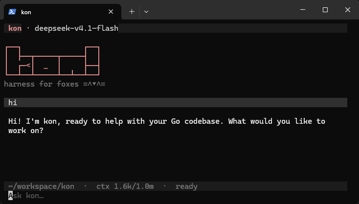

# kon

A coding agent for your terminal. Starts in 27 ms. One binary. Every OS.

kon reads, edits, and runs commands in your project until the work is done. One
12 MB executable: no runtime, no daemon, no warm-up.

**[kon.kitsu.red](https://kon.kitsu.red)**



## Install

Linux and macOS:

```sh
curl -fsSL https://raw.githubusercontent.com/hizkifw/kon/main/scripts/install.sh | sh
```

Windows, in PowerShell:

```powershell
iwr -useb https://raw.githubusercontent.com/hizkifw/kon/main/scripts/install.ps1 | iex
```

With Go:

```sh
go install github.com/hizkifw/kon/cmd/kon@latest
```

## Get started

Run `kon` in any project. Connect a provider with `/login`, pick a model with
`/model`, and start typing. To set things up by hand, see
[configuration](docs/product/configuration.md).

## Why kon

- **Four sharp tools.** `read`, `write`, `edit`, and `shell`, after
  [pi](https://pi.dev/). Context goes to your code, not a tool menu.
- **Instant.** 27 ms from launch to first frame. No update check, no catalog
  refresh, and no session scan on launch.
- **Native everywhere.** Linux, macOS, and Windows on x64 and ARM64. No WSL, no
  account, no plugins.
- **No lock-in.** Sessions are plain JSONL you can read, grep, and keep.
  OpenAI, Anthropic, OpenRouter, Ollama, or any OpenAI-compatible endpoint.

## Commands

| Command | Does |
| --- | --- |
| `kon` | Start a session in the current directory |
| `kon --resume` | Reopen the latest session here |
| `kon --incognito` | Start a session that is never saved |
| `kon run <message>` | Send one prompt and stream the reply to stdout |
| `kon md [file]` | Render Markdown in the terminal, as it streams in |
| `kon upgrade` | Install the latest verified release |
| `kon models` | List models offline; `--refresh` updates the catalog |
| `kon docs` | Unpack the user guide as Markdown |
| `kon tool webfetch <url>` | Print a web page as Markdown |

`kon run` is built for pipelines: `git diff | kon run --stdin review this`. Add
`--format json` for one event per line, or pipe the reply into `kon md` to see
it rendered as it streams. `kon --help` lists every flag.

## Documentation

- [Using kon](docs/product/usage.md) — commands, keys, sessions, and tools
- [Configuration](docs/product/configuration.md) — models, providers, and project instructions
- [Development](docs/development/index.md) — building and contributing
- [Architecture](docs/development/architecture.md) — how the pieces fit together
- [Session format](docs/development/session-format.md) — the on-disk JSONL contract
- [Storage migrations](docs/development/migrations.md) — version upgrades and recovery
- [Rendering performance](docs/development/rendering-performance.md) — how the TUI stays fast

## License

MIT
